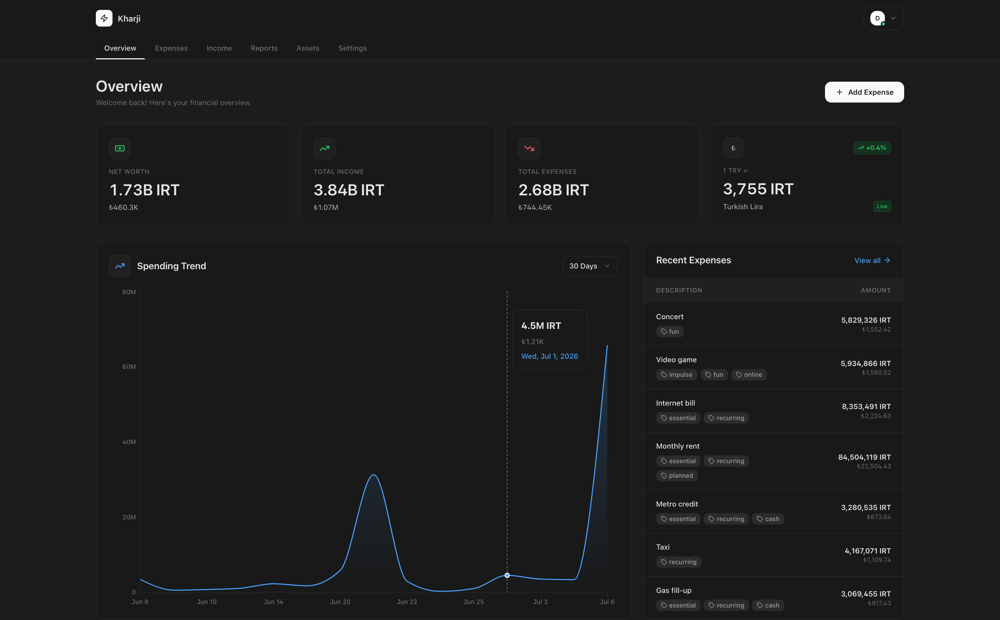
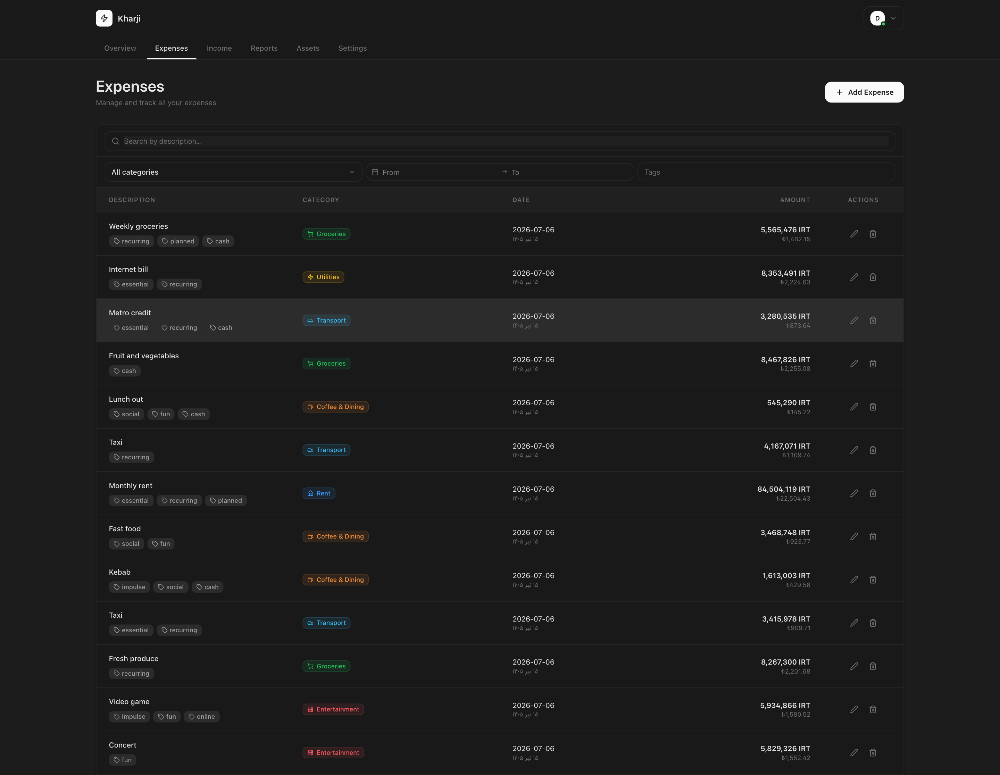
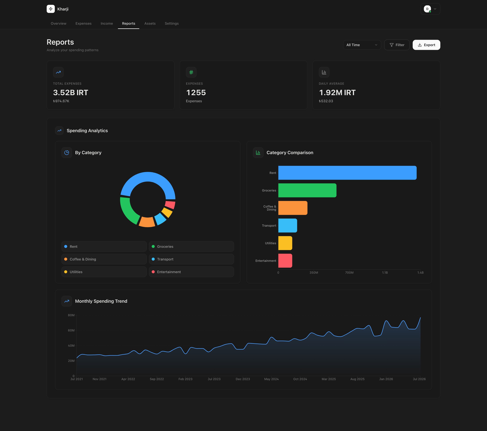
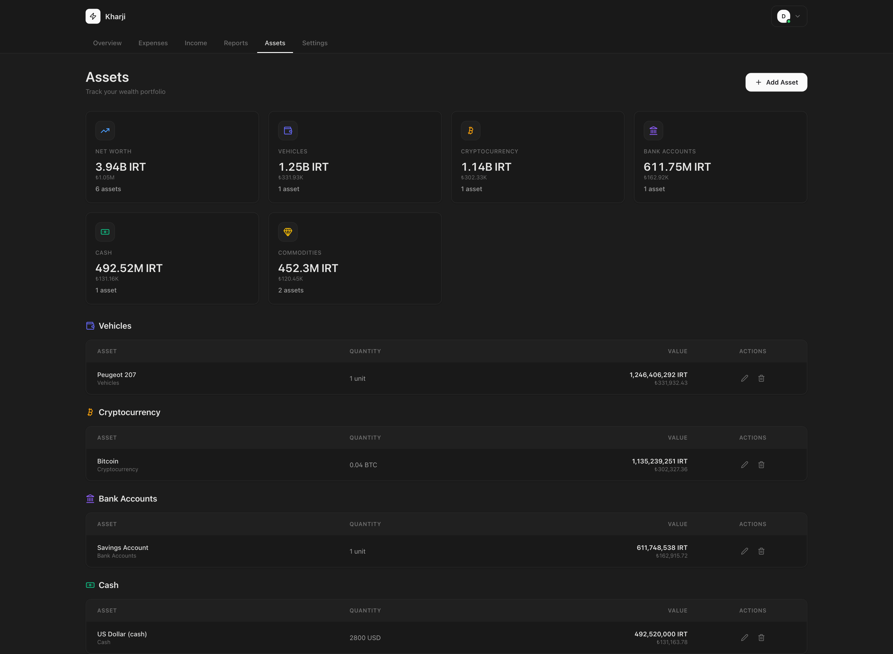
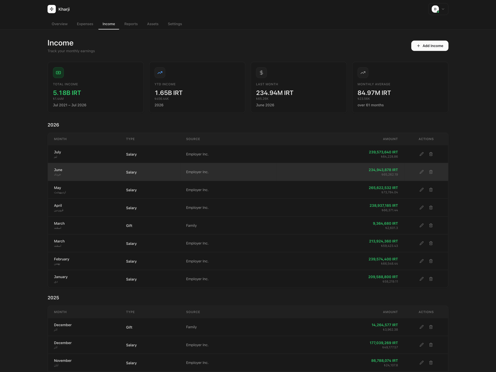
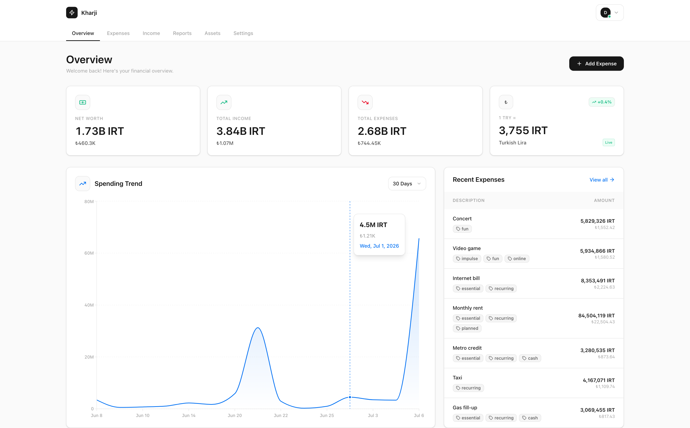
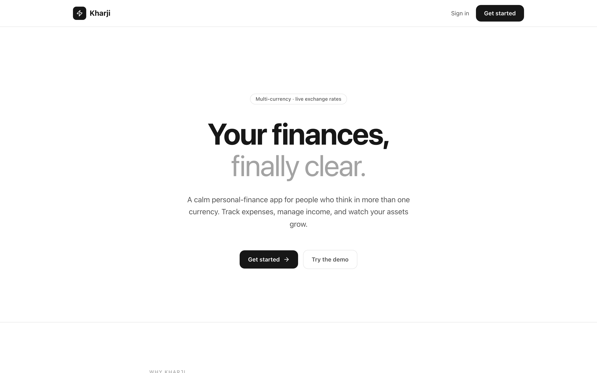

<div align="center">


# Kharji

**Your finances, finally clear.**

A calm personal-finance app for people who think in more than one currency.
Track expenses, manage income, and watch your assets grow.

[**Live App**](https://kharji.app) · [Try the Demo](https://kharji.app/login) · [Report a Bug](https://github.com/erfanansari/kharji/issues)


<br />



</div>

---

## Why Kharji?

Most finance apps assume you live in one currency. Kharji is built for people who don't — expats, freelancers with international clients, and anyone living between a local currency and the dollar. Every transaction is stored with the exchange rate of its day, so your history stays accurate even when rates move.

The entire codebase is public so you can read every line of code that touches your financial data before trusting it with your money.

## Features

- 💸 **Expense tracking** — log daily expenses with custom categories, tags, and full-text search
- 💰 **Income management** — track monthly income by type (salary, freelance, investment, and more)
- 🏦 **Asset portfolio** — track wealth across cash, crypto, commodities, vehicles, property, bank accounts, and investments, with full valuation history and a net-worth chart
- 🌍 **Multi-currency** — six currencies (IRT, USD, EUR, GBP, AED, TRY) with live exchange rates and per-date historical conversion
- 📊 **Reports** — spending analytics with daily, weekly, and monthly granularity, category breakdowns, and trends
- 🏷️ **Tags & categories** — create tags inline as you type, manage everything centrally in Settings
- 📤 **Excel export & import** — your data is never locked in
- 📧 **Email reports** — optional monthly and yearly summaries delivered to your inbox
- 🌙 **Dark mode** — easy on the eyes, day or night
- ⌨️ **Command palette** — jump anywhere with a keystroke
- 📱 **Installable PWA** — add it to your home screen like a native app
- 🔐 **Privacy-first auth** — custom JWT auth with HTTP-only cookies, PBKDF2-hashed passwords, no third-party auth provider
- 💾 **Daily backups** — automated encrypted database dumps with 30-day retention

## Screenshots

|                       Expenses                        |                   Reports                   |
| :---------------------------------------------------: | :-----------------------------------------: |
|          |  |
|                      **Assets**                       |                 **Income**                  |
|              |    |
|                    **Light Mode**                     |              **Landing Page**               |
|  |  |

## Tech Stack

| Layer         | Choice                                                  |
| ------------- | ------------------------------------------------------- |
| Framework     | [Next.js 16](https://nextjs.org) (App Router, React 19) |
| Language      | TypeScript (strict)                                     |
| Database      | [Turso](https://turso.tech) (libSQL / SQLite)           |
| Styling       | Tailwind CSS v4                                         |
| Charts        | Recharts                                                |
| Tables & data | TanStack Table v8 · TanStack Query v5                   |
| Auth          | Custom-built (JWT, HTTP-only cookies)                   |
| Email         | Resend + React Email                                    |
| Validation    | Zod                                                     |
| PWA           | Serwist                                                 |

## Getting Started

### Prerequisites

- Node.js 22+
- pnpm 10+
- A free [Turso](https://turso.tech) database

### Setup

```bash
# 1. Clone and install
git clone https://github.com/erfanansari/kharji.git
cd kharji
pnpm install

# 2. Configure environment
cp .env.example .env.local   # then fill in your values

# 3. Run database migrations
pnpm migrate

# 4. (Optional) seed a demo user with sample data
pnpm db:seed

# 5. Start the dev server
pnpm dev                     # http://localhost:3000
```

### Environment Variables

Only four variables are required — everything else degrades gracefully when unset.

| Variable                                                              | Required | Description                                                                        |
| --------------------------------------------------------------------- | :------: | ---------------------------------------------------------------------------------- |
| `TURSO_DATABASE_URL`                                                  |    ✅    | Turso database connection URL                                                      |
| `TURSO_AUTH_TOKEN`                                                    |    ✅    | Turso authentication token                                                         |
| `JWT_SECRET`                                                          |    ✅    | Long random string used to sign session tokens                                     |
| `APP_URL`                                                             |    ✅    | Public URL of the app (e.g. `http://localhost:3000`)                               |
| `NAVASAN_API_KEY`                                                     |    —     | Live exchange rates ([Navasan](https://navasan.tech)); falls back to the free tier |
| `RESEND_API_KEY`                                                      |    —     | Transactional email ([Resend](https://resend.com)); emails are skipped if unset    |
| `CRON_SECRET`                                                         |    —     | Authenticates scheduled jobs (reports, backups, rate refresh)                      |
| `B2_KEY_ID` / `B2_APPLICATION_KEY` / `B2_BUCKET_NAME` / `B2_ENDPOINT` |    —     | Daily database backups to Backblaze B2                                             |

## Development

```bash
pnpm dev          # start dev server
pnpm build        # production build
pnpm check        # lint + format check + typecheck
pnpm test         # run unit tests (Jest + React Testing Library)
pnpm email:dev    # preview email templates at http://localhost:3001
```

### Project Structure

```
src/
├── @schemas/      Zod validation schemas + tests
├── @types/        TypeScript type definitions
├── app/           Next.js App Router pages + API routes
├── components/    Shared UI primitives (Button, Modal, Toast, …)
├── constants/     Centralized category/type/currency definitions
├── core/          Database client, migrations, auth, exchange rates
├── emails/        React Email templates
├── features/      Feature-scoped components (expenses, income, assets)
├── hooks/         Shared React hooks
└── utils/         Pure utility functions + tests
```

## Contributing

Bug reports and pull requests are welcome. For larger changes, please open an issue first to discuss what you'd like to change, and make sure `pnpm check && pnpm test` passes before submitting.

## License

Kharji is published under the **Kharji Source-Available License (View-Only) v1.0** — see [LICENSE](./LICENSE) for the full text.

The source is public for transparency and auditability: you should be able to read every line of code that touches your financial data before trusting it.

- **You can:** read, audit, quote excerpts, and submit pull requests
- **You cannot:** run/host/deploy, fork, reuse in another project, or redistribute

To use Kharji outside these terms, contact **dev.erfanansari@gmail.com**.

---

<div align="center">
Made with ❤️ by <a href="https://github.com/erfanansari">Erfan Ansari</a>
</div>
